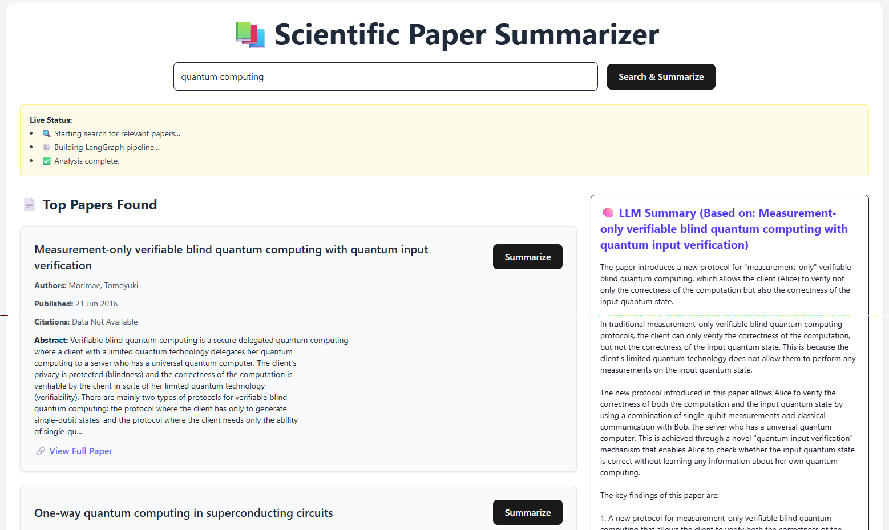

# Multi-Source Paper Summarizer

This is a full-stack application that allows users to search scientific papers from multiple public sources (like CORE and arXiv), and get summarized insights using a Large Language Model (LLM).

---

## 🌐 Features

- 🔍 Search for academic papers using a single query
- 📄 View metadata like title, authors, citation count, and publication date
- 🧠 Get concise LLM-generated summaries of the papers
- 📥 Download summaries as `.txt` files
- ⚡ Live status updates while the backend processes your query

---

## 🧩 Tech Stack

### Frontend
- React + Vite
- TailwindCSS

### Backend
- Python + FastAPI
- SSE (Server-Sent Events) for streaming status
- CORE API and arXiv as data sources

### LLM 
- LangChain
- Ollama
- LLaMA3

---

## 🚀 Getting Started

### 1. Clone the Repo

```bash
git clone https://github.com/your-username/multi-source-paper-summarizer.git
cd scientific-agent-app
```

---

### 2. Setup Backend

```bash
cd backend
python -m venv venv
```

**Activate the virtual environment:**

- On Windows:

```bash
venv\Scripts\activate
```

- On macOS/Linux:

```bash
source venv/bin/activate
```

**Install dependencies and run the server:**

```bash
pip install -r requirements.txt
uvicorn main:app --reload --port 8000
```

> Ensure CORS is allowed in `main.py`:
> ```python
> origins = [os.getenv("FRONTEND_ORIGIN")]
> allow_origins=origins
> ```

---

### 3. Setup Frontend

```bash
cd ../frontend
npm install
npm run dev
```

---

### 4. Environment Variables

**Frontend: `frontend/.env`**

```env
VITE_BACKEND_URL=http://localhost:8000
```

**Backend: `backend/.env`**

```env
CORE_API_KEY=your-core-api-key-here
FRONTEND_ORIGIN=http://localhost:5173
```

---

### 5. LLM Setup (LangChain + Ollama + LLaMA3)

#### 5.1 Install Ollama

Follow instructions at: [https://ollama.com](https://ollama.com)

#### 5.2 Pull the LLaMA3 Model

```bash
ollama pull llama3
```

#### 5.3 Backend Integration

In `main.py`, we use LangChain’s Ollama integration like this:

```python
from langchain_ollama import ChatOllama
llm = ChatOllama(model="llama3", temperature=0.0)
```

No API key required for Ollama running locally.

#### 5.4 Run Ollama

```bash
ollama run llama3
```

Make sure `ollama` is running in background.

---

### 6. Get CORE API Key

To use the CORE dataset, you'll need to obtain a free API key:

1. Go to [https://core.ac.uk/services#api](https://core.ac.uk/services#api)

2. Sign up and request an API key for personal or research use.

3. Add it to your backend/.env file.

### 7. Project Structure

```
scientific-agent-app/
├── backend/
│   ├── main.py
│   └── ...
├── frontend/
│   ├── src/
│   └── public/
├── .gitignore
├── README.md
```

---

## 🖼️ Screenshots

> 